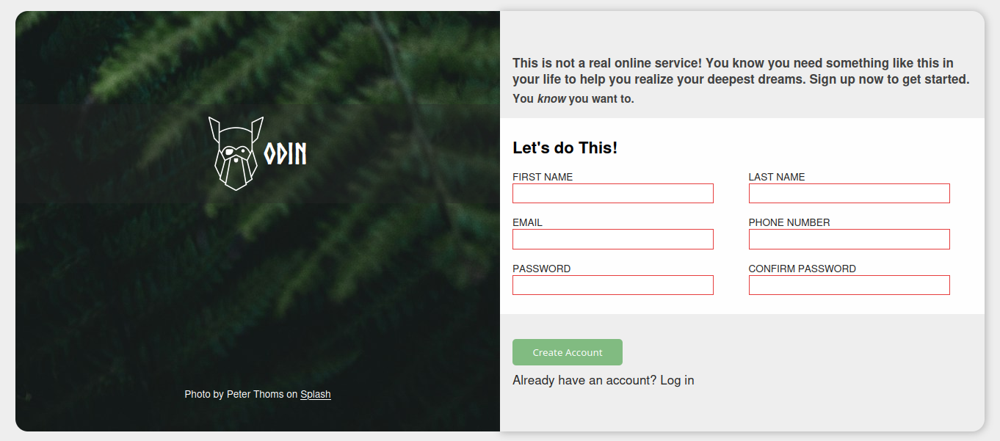

# 📋 Signup Page Project

A simple and responsive signup page built using **HTML** and **CSS**. This project demonstrates how to create a modern user registration form with a clean and mobile-friendly layout.

---

## 🚀 Features

- Fully responsive design
- Clean and modern UI
- Form input fields:
  - Full Name
  - Email
  - Password
  - Confirm Password
- CSS-only styling and layout
- Placeholder for future validation

---

## 🛠 Tech Stack

- **HTML5** – For page structure and form elements
- **CSS3** – For design, layout, and responsiveness

---

## 📷 Preview

  


---

## 🔧 Setup Instructions

1. **Clone the Repository**
   ```bash
   git clone https://github.com/yourusername/signup-page.git
   cd signup-page
